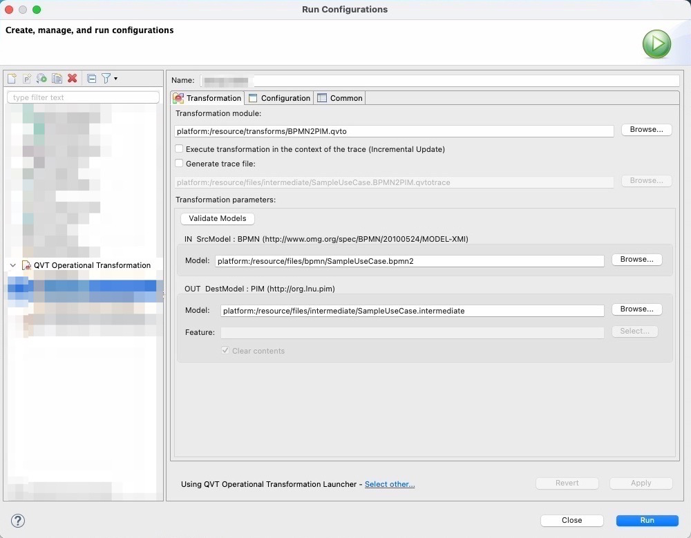
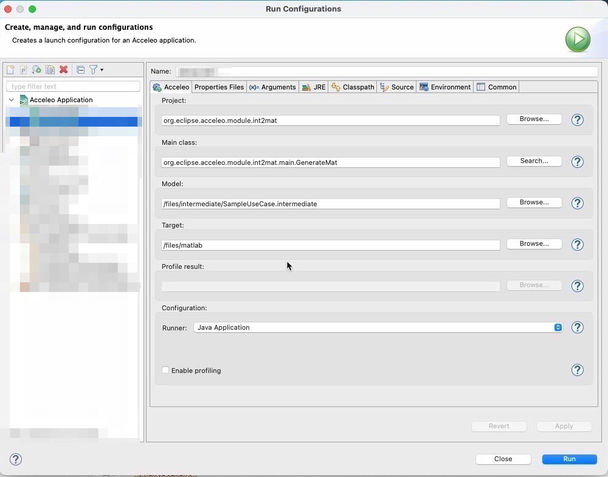

<h1>Biz2Sim</h1>

Biz2Sim is a Model Driven Tool that converts BPMN process models into a custom
Platform Independent Model (PIM) that acts as a bridge between the business and
the simulation domains and, ultimately, into a Platform Specific Model (PSM)
among the supported ones. The <code>.ecore</code> metamodel for the PIM may be
found in the <code>PIM Metamodel/intermediate/model</code> folder. As for the 
latest version, the only target simulation platform supported is Simulink
SimEvents.

<h3>Available modules</h3>
<b><i>Process model to PIM</b></i>:
<ul>
<li><i>BPMN:</i> The <code>QVTo</code> module is located in 
<code>M2M/BPMN2Intermediate/transforms/BPMN2PIM.qvto</code>. The input process
model should be in <code>.bpmn2</code> format.</li> The <a href="https://www.eclipse.org/bpmn2-modeler/">BPMN2 Modeler</a>
extension of Eclipse is recommended to build and visualize the diagram.
</ul>
<b><i>PIM to simulation model</i></b>
<ul>
<li><i>Simulink SimEvents:</i> The <code>Acceleo</code> module is
located in <code>M2T/org.eclipse.acceleo.module.int2mat/src/org/eclipse/acceleo/module/int2mat/main/generateMat.mtl</code>.
The output file will be a <code>.m</code> file that should be run in MATLAB
with the command <code>run("PATH_TO_FILE/simulinkModelGenerator.m")</code> and
will return a simulation model in <code>.slx</code> format along with a
performance analysis.
</li></ul>

<h2>Quick Setup</h2>
Install the latest version of <a href="https://www.eclipse.org/downloads/packages/release/2023-03/r/eclipse-modeling-tools">Eclipse Modeling Tools</a>
along with the <a href="https://projects.eclipse.org/projects/modeling.mmt.qvt-oml">QVTo</a> and <a href="https://www.eclipse.org/acceleo/">Acceleo</a> Plugins,
then clone/import the desired module(s) and index them in a new Eclipse Project of their type.
Make sure that all the input models are indexed in the <i>Model Explorer</i> as well.
Don't forget to provide Eclipse with a <a href="https://www.oracle.com/java/technologies/downloads/">JDK</a>.
<h3>QVTo modules</h3>
Open the <i>Run Configurations</i> menu in Eclipse (One quick way is shown in
the image below).
</img>
 
Create a new configuration of type <b>QVT Operational Transformation</b>.
Set the desired <code>.qvto</code> file as the <i>Transformation module</i> and
specify the path of the <i>Source Model(s)</i> in the required format. Browse the
desired path for the <i>Destination Model</i> to be saved in and click the <i>Run</i>
button.
</img>

<h3>Acceleo modules</h3>
Open the <i>Run Configurations</i> menu in Eclipse to access and edit the
transformation's settings before running it.
</img>
 
Create a new configuration of type <b>Acceleo Application</b>.
Set the correct module folder as <i>Project</i> and the <code>.java</code> file
at the same level of the module's <code>.mtl</code> file as the <i>Main class</i>.
Specify the path of the source <i>Model</i> in the required format. Browse the
desired path for the <i>Target</i> model to be saved in and click the <i>Run</i>
button.
</img>